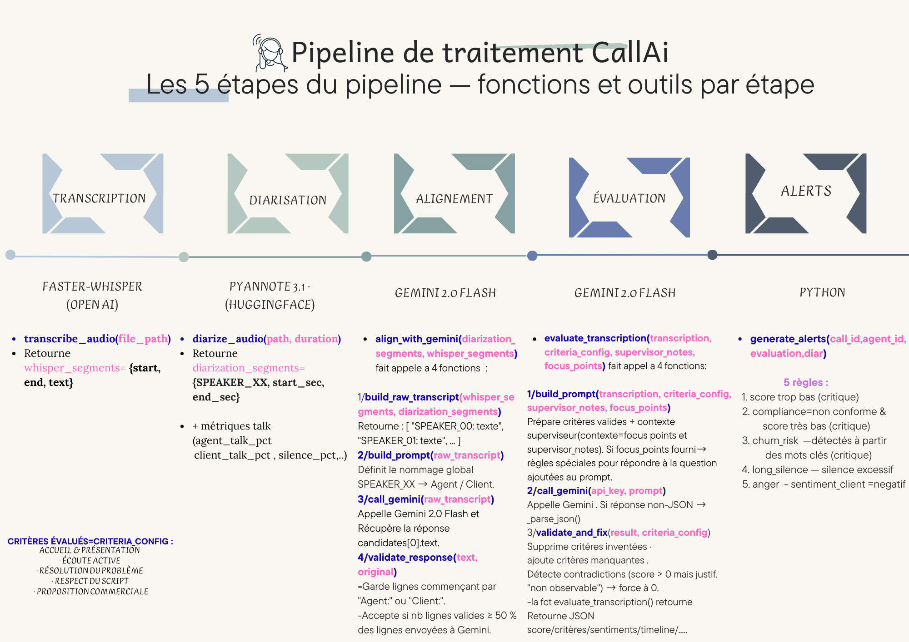

# CallAI — Système d'évaluation automatique des appels

# Présentation du projet
- CallAI est une plateforme d’analyse intelligente des appels de centre d'appel, combinant transcription audio, diarisation et modèles LLM pour évaluer automatiquement la qualité des interactions et générer  alertes et des recommandations de coaching.

# Technologies utilisées
- Backend: FastAPI (Python)
- Documentation API : Swagger
- Transcription: Whisper(Open AI)
- Diarisation : pyannote / speaker-diarization-3.1
- Alignement & Évaluation:Nommage locuteurs + évaluation qualité +génération des fiches coaching (Gemini 2.5 flash)
- Base de données : PostgreSQL
- Frontend : HTML,CSS,JS 

# Fonctionnalités principales
- Upload audio : Permet au superviseur de charger un fichier .wav et de renseigner :
       - Agent concerné et date/heure de l'appel 
       - Type d'appel 
       - Priorité
       - Contexte superviseur
       - Points à vérifier
       - critères actifs avec leurs points maximum
       
- Consulter via page du dashboard :
       - Appels analysés Score moyen
       - Taux de conformité
       - Alertes critiques
       - Score moyen par équipe
       - Répartition des scores (Conforme / Partiel / Critique)-Appels par type (Réclamation / Commercial / Technique)
       - Liste des derniers appels avec score, statut et lien vers le rapport.

- Consulter liste complète et filtrée de tous les appels analysés
       - Filtres : période · score · agent · type · priorité · recherche textuelle

- Accéder à un rapport détaillé d'appel.

- Consulter à la liste des agents avec leurs statistiques (l'agent avec le score le plus bas , le meilleur score )+ possibilité de filtrer par équipe.

- Accéder à une fiche de coaching par appel. 

- Consulter liste des alertes + possibilité de marquer une alerte comme traitée.

# Installation et démarrage

## 1/Prérequis
- Python 3.13.3
- PostgreSQL
- Clé API Gemini (console.cloud.google.com)
- Token HuggingFace (huggingface.co) pour pyannote

## 2/Installation
pip install -r requirements.txt

## 3/Créer la base de données
- Créer la base et les tables :
psql -U postgres -c "CREATE DATABASE callai;"
psql -U postgres -d callai -f schema_callai.sql

## 4/Installer FFmpeg (obligatoire pour l’audio)whisper utilise ffmpeg pour extraire le son et lire l audio 
- Il faut installer FFmpeg et ajouter le chemin de bin ds les variables d'environnement(dans Path)

## 5/Configuration environnement
- Créer le fichier .env dans la racine du projet et mettre :

- Gemini API (évaluation + alignement + coaching)
GEMINI_API_KEY=.............

- HuggingFace (pyannote diarisation)
HF_TOKEN=.................

## 6/Démarrer le serveur
uvicorn main:app --reload

# Structure du Projet 
C:.
│   .env
│   .gitignore
│   main.py
│   README.md
│   requirements.txt
│   schema_callai.sql
│   
├───api
│   │   routes_agents.py
│   │   routes_alerts.py
│   │   routes_calls.py
│   │   routes_coaching.py
│   │   routes_criteria.py
│   │   routes_dashboard.py
│   │   routes_upload.py
|         
├───core
│   │   database.py
|
├───pipeline
│   │   alerts.py
│   │   diarize.py
│   │   evaluate.py
│   │   runner.py
│   │   transcribe.py
│           
├───static
│   ├───css
│   │       style.css
│   │       theme.css
│   │       
│   └───js
│           agents.js
│           alerts.js
│           audio.js
│           calls.js
│           coaching.js
│           dashboard.js
│           rapport.js
│           upload.js
│           
├───templates
│       agents.html
│       alerts.html
│       audio.html
│       base.html
│       calls.html
│       coaching.html
│       dashboard.html
│       rapport.html
│       upload.html
│       
├───uploads
│       05a4d192-863b-4e46-805c-677374ddb073.wav
│       18b55f1f-260f-424b-8925-c83b039642c2.wav
│       1d492869-3d66-49fd-9d97-bde8de173295.wav
│       241504f5-585e-4035-9a21-154a772dedc4.wav
│       245549af-c49d-47c9-a657-199e061ab538.wav
        
## Architecture du système
 - le pipeline du projet CallAI :

## Documentation API
Après démarrage du serveur la documentation complète de l'API est disponible via Swagger :

http://127.0.0.1:8000/docs